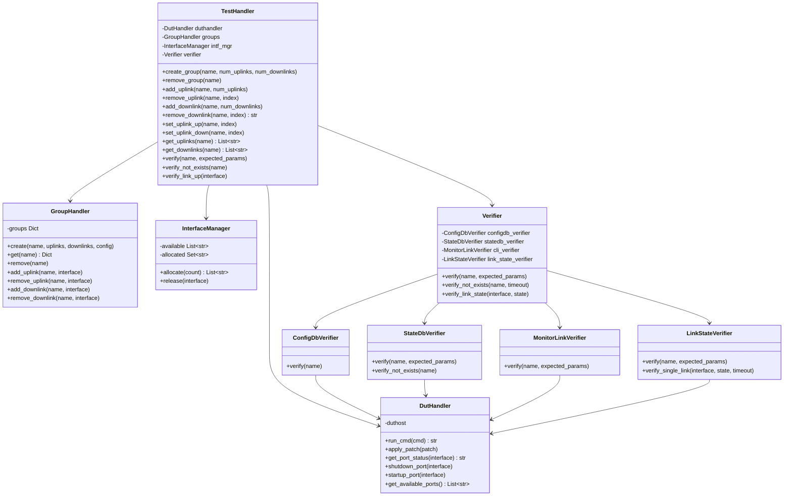

# Monitor Link Group Tests

Automated tests for the SONiC Monitor Link Group feature.

## Overview

Monitor Link Group allows configuring groups of uplinks and downlinks where the downlink state follows the uplink state. When uplinks go down (below `min_uplinks` threshold), downlinks are automatically brought down.

## Class Diagram



## Fixtures

Defined in `conftest.py`:

### `handler`
Provides a `TestHandler` instance for interacting with the DUT.

```python
def test_example(handler):
    handler.create_group('my-group', num_uplinks=2, num_downlinks=1)
```

## File Structure

```
tests/monitor-link-group/
├── README.md                      # This file
├── conftest.py                    # Fixtures and pytest config
├── test_monitor_link.py    # Monitor Link tests
└── lib/
    ├── __init__.py
    ├── test_handler.py            # High-level test API
    ├── dut_handler.py             # DUT interaction
    └── verifiers/
        ├── __init__.py
        ├── cli.py                 # CLI output verification
        ├── statedb.py             # STATE_DB verification
        ├── configdb.py            # CONFIG_DB verification
        └── link_state.py          # Link operational state verification
```
